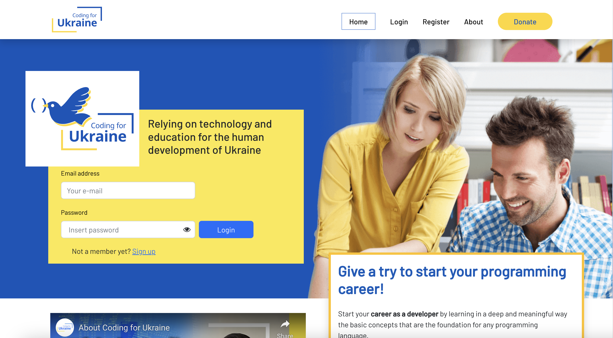
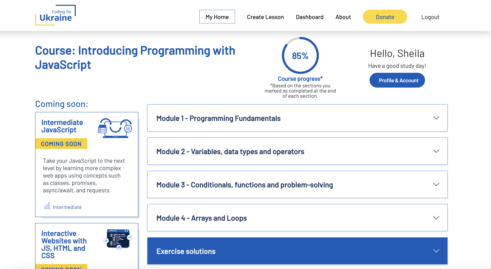

# Coding for Ukraine - Learning Management System

This repository contains the source code for the Learning Management System (LMS) developed for Coding for Ukraine, an initiative aimed at providing coding education and support for Ukraine amidst the ongoing crisis.

## About
Coding for Ukraine is a charitable project that offers coding courses, resources, and support to individuals affected by the crisis in Ukraine. This Learning Management System serves as a platform to deliver educational content, facilitate communication between instructors and students, and manage course materials.

## Features
- **Course Management:** Create, manage, and organize coding courses efficiently.
- **User Profiles:** Students and instructors can create profiles, track progress, and access course materials.
- **Admin Dashboard:** Administrative tools for managing courses, users, and content.





## Installation and Setup
To set up the LMS locally, follow these steps:

1. **Clone the Repository:**
    ```bash
    git clone https://github.com/sheilatavares/lms_codingforukraine.git
    ```

2. **Install Dependencies:**
    ```bash
    cd lms_codingforukraine
    # Run appropriate package manager command (e.g., npm install or yarn)
    npm install
    ```

4. **Run the Application:**
    ```bash
    # Start the development server
    npm start
    ```

5. **Access the Application:**
    Open a web browser and go to [http://localhost:3000](http://localhost:3000) to view the LMS.

## Contributing
Contributions to this project are welcome! If you'd like to contribute, please follow these steps:
1. Fork the repository.
2. Create your feature branch (`git checkout -b feature/YourFeature`).
3. Commit your changes (`git commit -am 'Add some feature'`).
4. Push to the branch (`git push origin feature/YourFeature`).
5. Create a new Pull Request.

## Deployment
This LMS is deployed and accessible at [Coding for Ukraine - LMS](https://codingforukraine.org/). 

## License
This project is licensed under the MIT License - see the [LICENSE](LICENSE) file for details.

## Acknowledgements
Special thanks to all contributors and supporters of Coding for Ukraine for their dedication and commitment to providing education and support during this critical time.
